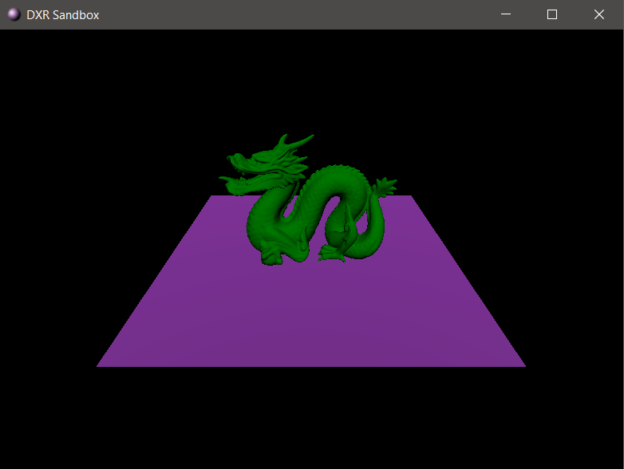

# DXR-Sandbox
Very simple toy-framework for testing DirectX Raytracing and improving DirectX 12 knowledge.
I am trying to make it as simple as I can, keeping as much as possible in one DXRSExampleScene.cpp and putting things outside of it when necessary (buffer, mesh classes, etc.) There are already too many lines there due to DX12...

I have also used some helper classes from Microsoft samples (https://github.com/microsoft/DirectX-Graphics-Samples/tree/master/Samples/Desktop/D3D12Raytracing) and NVIDIA samples (https://github.com/NVIDIAGameWorks/DxrTutorials/).

This project is not an ideal engine or whatever but just a way to test things quickly if you want to learn DXR.

# Features (not raytracing)
- Deferred Rendering (without texture support for now)
- 3D model loading with Assimp
- Orbit camera

# Features (raytracing)
- full essential DXR setup with RayGen/Miss/Hit shaders, accelaration structures, etc.
- simple raytracing of camera rays -> coloring objects from different hit groups

# TODO 
- Combine raytracing ouput with deferred lighting
- Ray Traced Shadows
- Ray Traced Reflections
- Ray Traced Ambient Occlusion
- PBR support
- ImGUI

# Additional libraries
- Assimp
- DirectXTK12

# Requirements
- VS2019
- DirectX12 with DXR
