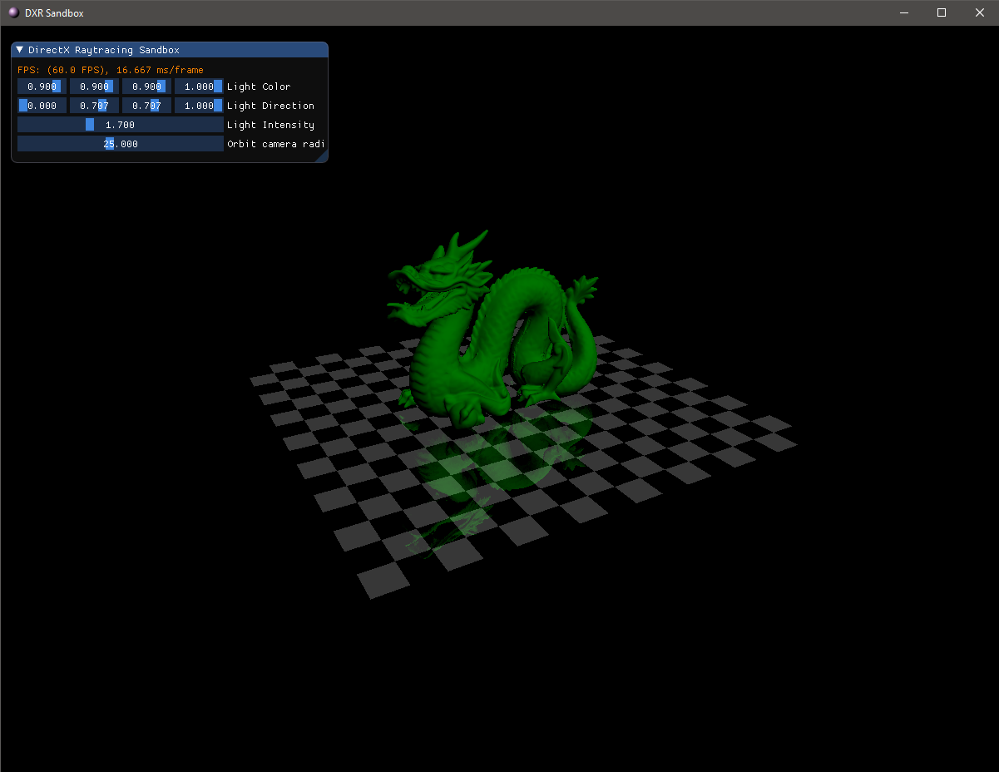

# DXR-Sandbox
Very simple toy-framework for testing DirectX Raytracing and improving DirectX12 knowledge.

# Features (not raytracing)
- Deferred Rendering (without texture support for now)
- 3D model loading with Assimp
- Orbit camera

# Features (raytracing)
- full essential DXR setup with RayGen/Miss/Hit shaders, accelaration structures, etc.
- simple raytracing of camera rays -> coloring objects from different hit groups

# TODO 
- Combine raytracing ouput with deferred lighting
- Ray Traced Shadows
- Ray Traced Reflections
- Ray Traced Ambient Occlusion

# Additional libraries
- Assimp
- DirectXTK12

# Requirements
- VS2019
- DirectX12 with DXR
